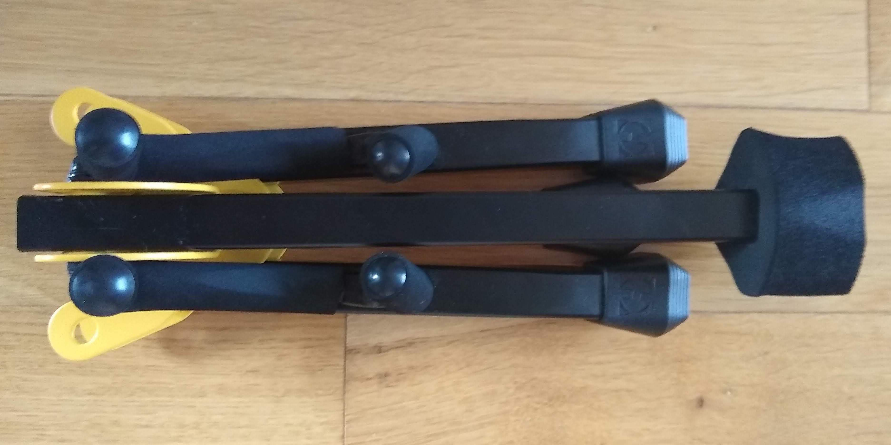
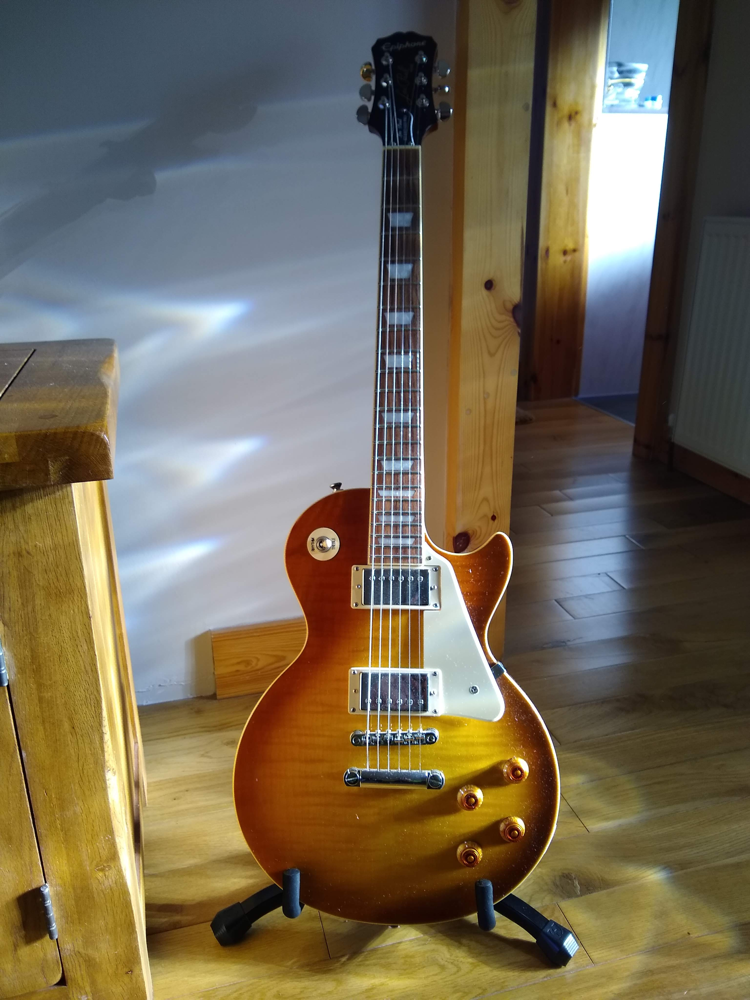
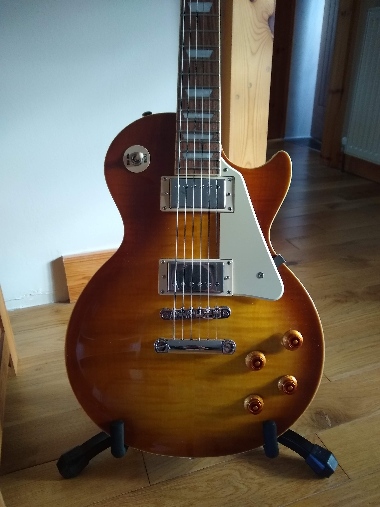
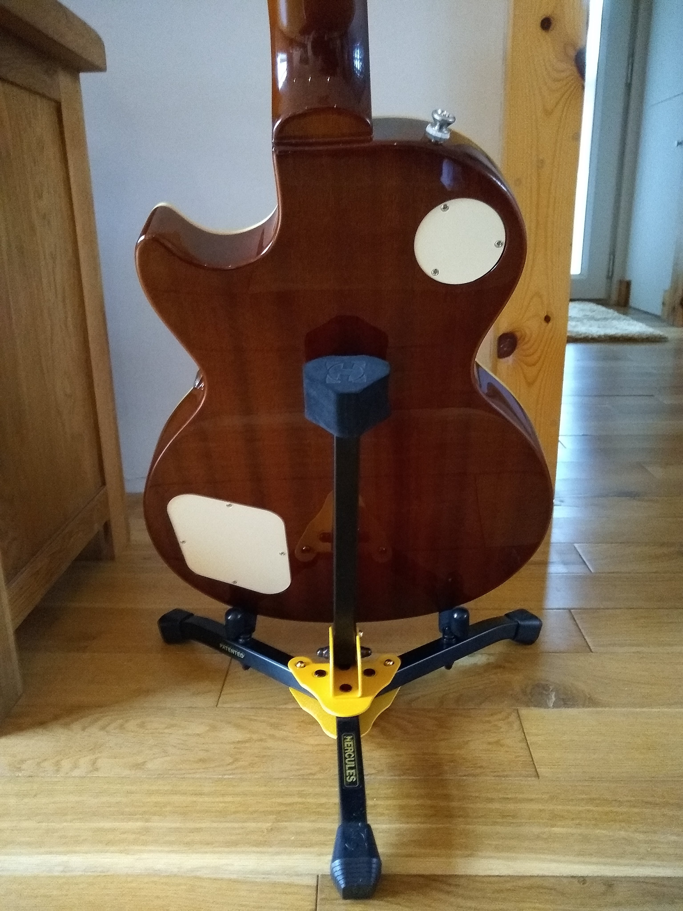
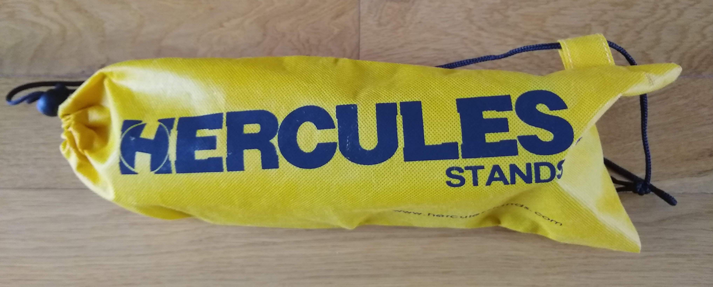
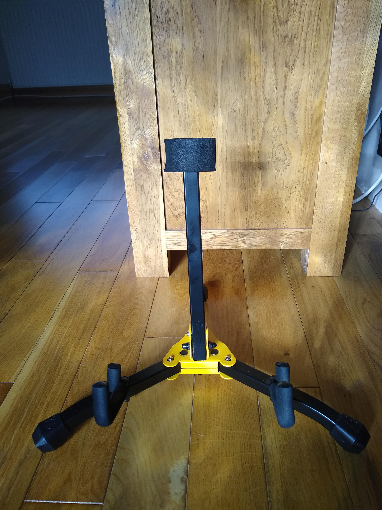
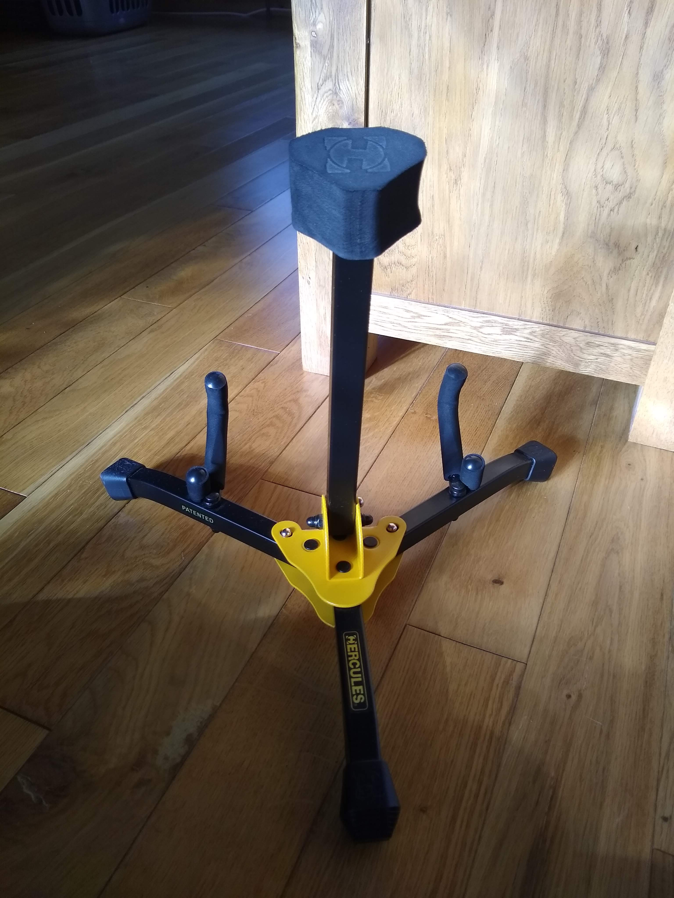

Let me introduce to you the Hercules GS402B Mini Guitar Stand. As the owner of newly purchased Epiphone Les Paul electric guitar, my most expensive guitar purchase to date, I was looking for a guitar stand which would allow me to put my instrument on display and be a permanent feature within my living room.

I bought this guitar not just for the way it sounds but also for the way it looks; I wanted it to be a functioning piece of furniture that would be easily accessible and not stored away in a cupboard like I had kept previous guitars. To satisfy this requirement I wished to find a free-standing guitar stand that would not detract from the shape or beauty of my instrument but would be sturdy enough to hold my guitar in place safely.

I also wanted to make sure the stand I chose would not scratch or dent my guitar when removing or placing it back in the stand. Having had some good and bad guitar stands over the years I was looking for a different brand and design from what I had used before.

**Step forward the Hercules GS402B Mini Guitar Stand**

After many weeks of deliberating over many different stands, my mind was made up after reading some great reviews on the Hercules GS402B Mini Guitar Stand and I purchased it from Amazon.

Upon opening my Amazon package I was not disappointed and was immediately happy with my purchase. The Hercules stand is small but mighty! Upon first observing it and then handling the stand you can feel the superior build quality. The stand is made of metal as are the fixtures and hinges and can support a guitar weighing up to 15kg (33lbs). The heavy-duty rubber feet provide a sturdy grip on any floor surface - mines stands on hardwood flooring - and the stand does not move or slide when taking it out or replacing the guitar in the stand. The stand has three locking pins which allow the stand to be set up with speed and security. This is a very solid and sturdy stand indeed.

The three points which make contact with the guitar - a large padded block which makes contact with the rear of the guitar and the two grips which support the bottom of the guitar - are made of SFF rubber which has protected my guitar's finish and kept my guitar free from any damage.

The below images show my guitar standing tall and proud and only the feet and lower part of this stand is visible; no other part of the stand can be seen which I love. It allows the guitar body to be presented mostly unobscured which appeals to me.

The Hercules stand comes in a handy carry bag and folds/opens easily if taking on the move. I take mines between home and the music studio when I am practising.

<!--  -->

I’ve been using this stand for over 10 months now and my guitar has taken pride of place in my living room. I'm so pleased with this stand that I also bought the Hercules Stands GS401BB Acoustic Guitar Stand for my acoustic guitar.

The Hercules GS402B Mini Guitar Stand and Hercules Stands GS401BB Acoustic Guitar Stand will both last me for many years to come due to their superior build quality; if I purchase another guitar in future then I'll also be adding another Hercules guitar stand to my order.

<!-- continue writing below -->

The stand has a height of 310mm, a base radius of 230mm and yoke length of 65mm. When folded, its overall dimensions are 282 x 105mm. Its weight is 0.9kg (1.9lbs).

A Hercules carrying bag made of heavy-duty nylon and including a drawstring is included for taking the stand on the move.

This product has earned a place on my Love This Product blog because it oozes quality. It folds and opens easily and keeps my guitar secure whether standing upright at home or in the studio. Hercules has my loyalty now when it comes to buying instrument stands.

<!-- [Les Paul body close up](http://en.wikipedia.org/wiki/Salted_duck_egg). -->